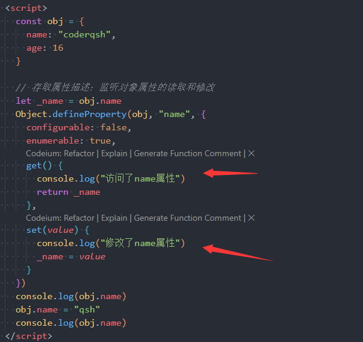

### 一.JS中this的指向

#### 1.1.this绑定

- **只有函数被执行的那一刻，才会决定函数内部的this所绑定的对象**

- **函数内部this所绑定的对象只与该函数的调用方式有关**

#### 1.2.this的默认绑定

- **默认绑定：函数独立调用，内部this绑定window对象**

- **函数赋值后进行独立调用，内部this绑定window对象**

- **严格模式下进行独立调用，内部this绑定undefined**

#### 1.3.this的隐式绑定

- **隐示绑定：函数通过对象进行调用，this绑定函数发起的对象**

#### 1.4.this的new绑定

- **函数可以当做类来进行new实例构造**
- **new的时候会创建一个空对象，并将函数内部的this绑定该对象**
- **再执行函数内部的代码**
- **最终返回new出来的新对象（该对象与new的函数同名）**

#### 1.5.this的显式绑定

- **apply(thisObj, [arg1, arg2, ...])：函数调用时显式的指定this所绑定的对象，第二个参数为传入的参数列表**

- **call(thisObj, arg1, arg2, ...)：函数调用时显式的指定this所绑定的对象，后续参数为传入的实参**

- **bind(thisObj, arg1, arg2, ...)：与call调用方式一致，只不过可以返回一个函数对象，该函数对象已经显示的指定this所绑定的对象，所以后续调用无需指定this**

#### 1.6.this绑定的优先级

- **默认绑定（独立调用）的优先级最低**

- **new绑定的优先级最高**
- **显示绑定的优先级高于隐式绑定**
- **bind绑定高于apply、call绑定**

#### 1.7.箭头函数中的this

- **箭头函数没有自己的this对象**

- **箭头函数中若要使用this，则会从上层作用域中查找**
- **箭头函数使用显示绑定无效（this只与上层作用域有关）**

- **面试题**

### 二.浏览器运行原理

####  2.1.浏览器渲染页面的流程

- **解析一：下载index.html文件，加载解析index.html文件，从而生成DOM树（doucument object model）**
- **解析二：下载css、js文件，加载解析css文件时会通过样式规则生成CSSOM树（css object model），这个过程不阻塞DOM树的生成，加载解析js文件时会阻塞DOM树的生成**
- **解析三：将CSSOM附加到DOM树上，从而生成Rander渲染树**
  - **DOM树与Rander树不是一一对应关系，Rander树中只有需要渲染的节点，DOM树上是所有节点（display:none）**
  - **渲染树上存在节点样式信息，但是不包括大小、位置信息**
- **解析四：通过layout布局来计算需要渲染的节点大小、位置等布局信息**
- **解析五：进行painting绘制，从而渲染整个页面**

#### 2.2.回流

- **浏览器渲染页面的时候，第一次计算并确定渲染节点的大小、位置信息被称为layout布局**
- **后续再计算并确定渲染节点的大小、位置信息被称为reflow回流**
- **只要重新布局就会引起回流**
  - **修改DOM树（对DOM节点的修改、删除、更新等操作）**
  - **修改节点的大小、位置信息（会再次进行布局计算）**
  - **修改window窗口的resize**
  - **调用getCompoutedStyle方法**

#### 2.3.重绘

- **重新对Rander树进行绘制就称为repaint重绘**
- **回流必定引起重绘，但重绘不一定回流（比如修改节点的颜色等样式）**
- **开发中尽量避免回流与重绘，会引起性能损耗问题**

#### 2.4.composite合成

- **默认情况下，Rander树中的渲染节点在标准流中会被绘制到同一个layer图层中**
- **但是可以通过一些特殊的属性来创建新的合成图层，从而通过GPU进行加速绘制，提高性能**
- **可以创建新图层的属性**
  - **position：fixed**
  - **开启transform、opacity动画**
  - **canvas、iframe、video元素**

#### 2.5.js文件的加载解析

- **浏览器加载解析HTML文档时，会下载并解析其他外部文件，比如css、js文件**
- **加载css文件时，不会阻塞DOM树的生成**
- **加载js文件时，会阻塞整个DOM树的生成，直到js文件全部加载解析完成**
- **这样的目的是，防止js文件中的DOM操作引起大量的回流与重绘**
- **但是如果js文件太大，就会执行时间会变长，所以可以通过defer、async属性来解决**

#### 2.6.defer与async

- **defer**
  - **浏览器解析带有defer属性的script元素时，它会告诉浏览器，可以继续生成DOM树**
  - **当DOM树生成结束后，在DOMContentLoaded事件触发前，会执行defer中的代码**
  - **defer按照顺序执行，推荐写在head元素内**
  
- **async**

  - **与defer一样，会告诉浏览器，它不会阻塞DOM树的生成**

  - **async下载完成后会立即执行里面的代码**
  - **async不是按照顺序执行的，他是异步执行的**

### 三.JS执行原理

#### 3.1.JS全局代码执行过程

- **初始化全局对象**

  - **执行全局代码前，会先在堆内存中创建一个全局对象（Global Object，GO）**

  - **然后将全局代码中定义的标识符添加到这个GO对象中，初始值为undefined**
  - **这个全局对象就是window对象**

- **创建全局执行上下文**
  - **全局对象初始化完成后，会在执行上下文栈中创建一个全局执行上下文（Global Ececution Content）**
  - **并关联一个VO对象，针对全局执行上下文这个VO对象就GO对象**
  - **将全局代码块中的代码添加到全局执行上下文中**
- **执行全局执行上下文中的代码**

#### 3.2.JS函数代码执行过程

- **创建函数AO对象**
  - **当全局执行上下文中执行到函数调用时，会在堆内存中创建一个AO对象（Activation Object，AO）**
  - **将函数代码块中定义的标识符添加到AO对象中**
- **创建函数执行上下文**
  - **当堆中AO对象创建完成后，会在执行上下文栈中创建一个函数执行上下文**
  - **并关联一个VO对象，该VO对象就是AO**
  - **然后将函数代码块中的代码添加到函数执行上下文中**
- **执行函数执行上下文中的代码**
  - **代码执行结束，栈中的函数执行上下文会被弹出销毁**
  - **再重新执行栈顶的执行上下文**

#### 3.3.变量查找作用域链

- **每个执行上下文都关联了一个VO对象，同时也关联了一个作用域链（scope chain）**
- **作用域链是一个列表对象，是在GO或AO对象创建时就已经决定了（Scopes）**
- **在执行上下文中执行代码查找变量时，先从当前VO对象中查找，再从作用域链中查找**

### 四.函数增强

#### 4.1.函数对象中的属性

- **name：函数对象的名称，不可修改**

- **length：函数可接收的形参个数，不包含剩余参数，不可修改**

- **arguments：函数接收的实参列表，是一个类数组对象（箭头函数没有arguments）**

- **arguments转数组的方法**

  - **循环push**
  - **解构**
  - **数组的from类方法**
  - **slice显式绑定arguments**

  

#### 4.2.纯函数（prue）

- **如果一个函数满足以下条件时，这个函数就被称为纯函数**

- **函数相同的输入，在任何场景下都具有相同的输出**
- **函数的调用不会产生任何副作用（不会影响其他变量）**

#### 4.3.柯里化函数（currying）

- **柯里化：将一个接收多个参数的函数，转化为接收一个参数且返回处理剩余参数的函数的新函数过程**

- **该新函数就被称为柯里化函数**

-  **封装自动柯里化函数**

### 五.对象增强

#### 5.1.数据属性描述符

- **可以通过Object.defineProperty(obj, prop, config)来描述对象中的属性**
- **configurable：是否允许删除**
- **enumerable：是否允许通过for...in遍历，Object.keys获取**
- **writable：是否允许写入修改**
- **value：指定返回值**

#### 5.2.存取（访问）属性描述符

- **可以通过Object.defineProperty(obj, prop, config)监听对象属性的读取和修改**

- **configurable：是否允许删除**
- **enumerable：是否允许通过for...in遍历，Object.keys获取**
- **get：监听访问时触发的函数**
- **set：监听赋值时触发的函数**

### 六.原型与面向对象

#### 6.1.普通对象的原型

- **对象除了自己定义的属性外，还存在一个[[Prototype]]属性**
- **这个[[Prototype]]属性指向一个对象，这个对象就是原型对象（并且是隐式原型）**

- **当访问对象中的属性时，若自己定义过则直接返回，若没有定义则在该对象的隐式原型对象上查找并返回**
- **获取对象原型的方法**
  - **obj.__proto\_\_**
  - **Object.getPrototypeOf(obj)**

#### 6.2.函数对象的原型

- **函数作为一个对象，它也有[[Prototype]]隐式原型对象**
- **除了[[Prototype]]外，函数还存在一个prototype显式原型对象**

- **当一个函数作为构造函数被new调用时，这个函数的prototype显式原型对象会被赋值给新对象的隐式原型对象**

- **也就是说，可以为构造函数的显式原型对象上添加方法，从而让实例对象共享调用**

#### 6.3.显式原型constructor属性

- **函数的显式原型对象上有一个constructor属性**
- **constructor是一个函数对象，指向原函数**

#### 6.4.原型赋值新对象

#### 6.5.ES5原型链

- **在JS中，通过字面量创建变量，实际上是通过new对应的包装类来创建**
- **每一个类实际上都是一个函数对象，所以它也有对应的隐式原型与显式原型**

- **原型对象也可能拥有原型，并且继承它的属性与方法，当查找变量时就会沿着原型一层层向上查找形成原型链**

#### 6.6.ES5利用原型链实现继承

- **方式一：将子类的显式原型指向父类的显式原型**

  - **将父类的显式原型赋值给子类的显式原型**
  - **而子类实例对象的隐式原型又指向子类的显式原型，所以子类实例对象可以访问父类显式原型上的属性方法**

  - **缺点：子类父类共享原型，一个修改全都修改；无法继承父类属性；子类没有自己特有的属性方法**

- **方式二：将子类的显式原型指向父类的实例对象**

  - **new一个父类的实例对象，这个实例对象的隐式原型指向父类的显式原型**

  - **再将子类的显式原型指向该父类的实例对象，此时子类的实例对象就可以访问父类的属性与方法**

  - **缺点：访问的属性与父类的实例对象有关**

- **方式三：借用构造函数实现属性的继承**

#### 6.7.

