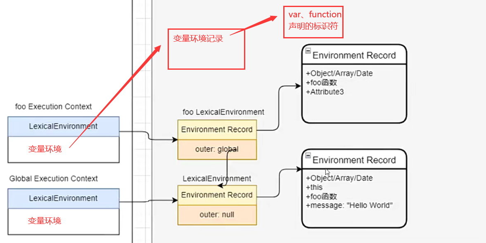
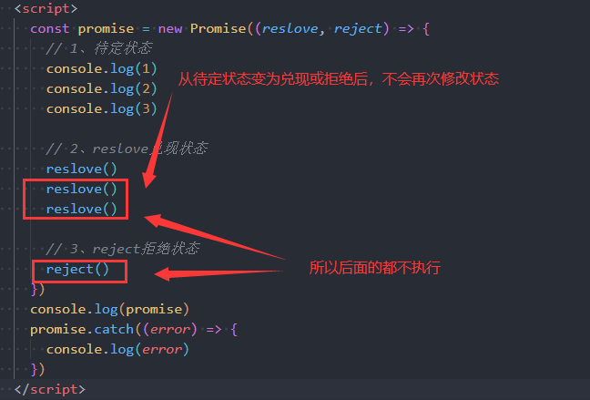
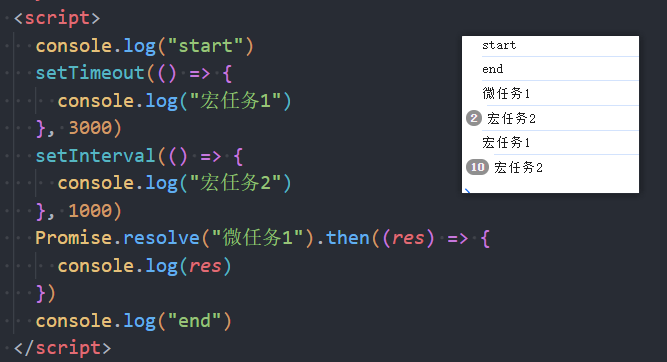

### 一.JS中this的指向

#### 1.1.this绑定

- **只有函数被执行的那一刻，才会决定函数内部的this所绑定的对象**

- **函数内部this所绑定的对象只与该函数的调用方式有关**

#### 1.2.this的默认绑定

- **默认绑定：函数独立调用，内部this绑定window对象**

- **函数赋值后进行独立调用，内部this绑定window对象**

- **严格模式下进行独立调用，内部this绑定undefined**

#### 1.3.this的隐式绑定

- **隐示绑定：函数通过对象进行调用，this绑定函数发起的对象**

#### 1.4.this的new绑定

- **函数可以当做类来进行new实例构造**
- **new的时候会创建一个空对象，并将函数内部的this绑定该对象**
- **再执行函数内部的代码**
- **最终返回new出来的新对象（该对象与new的函数同名）**

#### 1.5.this的显式绑定

- **apply(thisObj, [arg1, arg2, ...])：函数调用时显式的指定this所绑定的对象，第二个参数为传入的参数列表**

- **call(thisObj, arg1, arg2, ...)：函数调用时显式的指定this所绑定的对象，后续参数为传入的实参**

- **bind(thisObj, arg1, arg2, ...)：与call调用方式一致，只不过可以返回一个函数对象，该函数对象已经显示的指定this所绑定的对象，所以后续调用无需指定this**

#### 1.6.this绑定的优先级

- **默认绑定（独立调用）的优先级最低**

- **new绑定的优先级最高**
- **显示绑定的优先级高于隐式绑定**
- **bind绑定高于apply、call绑定**

#### 1.7.箭头函数中的this

- **箭头函数没有自己的this对象**

- **箭头函数中若要使用this，则会从上层作用域中查找**
- **箭头函数使用显示绑定无效（this只与上层作用域有关）**

- **面试题**

### 二.浏览器运行原理

####  2.1.浏览器渲染页面的流程

- **解析一：下载解析HTML，从上到下将元素抽象为DOM节点，再根据元素的嵌套关系生成DOM树（doucument object model）**
- **解析二：在解析HTML的过程中，遇见css则加载解析css、遇见js则执行js脚本**
  - **css的加载解析是交给渲染进程中的预解析线程处理（最终会根据样式规则生成CSSOM树），不会阻塞DOM树的生成**
  - **js脚本的执行会阻塞整个DOM的生成，因为js脚本中可能存在其他DOM操作（为了避免回流、重绘）**

- **解析三：将CSSOM附加到DOM树上，样式计算后而生成Rander渲染树**
  - **DOM树与Rander树不是一一对应关系，Rander树中只有需要渲染的节点，DOM树上是所有节点（display:none）**
  - **渲染树上存在节点样式信息，但是不包括大小、位置信息**
- **解析四：通过layout布局来计算需要渲染的节点大小、位置等布局信息**
- **解析五：进行painting绘制，从而渲染整个页面**

#### 2.2.回流

- **浏览器渲染页面的时候，第一次计算并确定渲染节点的大小、位置信息被称为layout布局**
- **后续再计算并确定渲染节点的大小、位置信息被称为reflow回流**
- **只要重新布局就会引起回流**
  - **修改DOM树（对DOM节点的修改、删除、更新等操作）**
  - **修改节点的大小、位置信息（会再次进行布局计算）**
  - **修改window窗口的resize**
  - **调用getCompoutedStyle方法**

#### 2.3.重绘

- **重新对Rander树进行绘制就称为repaint重绘**
- **回流必定引起重绘，但重绘不一定回流（比如修改节点的颜色等样式）**
- **开发中尽量避免回流与重绘，会引起性能损耗问题**

#### 2.4.composite合成

- **默认情况下，Rander树中的渲染节点在标准流中会被绘制到同一个layer图层中**
- **但是可以通过一些特殊的属性来创建新的合成图层，从而通过GPU进行加速绘制，提高性能**
- **可以创建新图层的属性**
  - **position：fixed**
  - **开启transform、opacity动画**
  - **canvas、iframe、video元素**

#### 2.5.js文件的加载解析

- **浏览器加载解析HTML文档时，会下载并解析其他外部文件，比如css、js文件**
- **加载css文件时，不会阻塞DOM树的生成**
- **加载js文件时，会阻塞整个DOM树的生成，直到js文件全部加载解析完成**
- **这样的目的是，防止js文件中的DOM操作引起大量的回流与重绘**
- **但是如果js文件太大，就会执行时间会变长，所以可以通过defer、async属性来解决**

#### 2.6.defer与async

- **defer**
  - **浏览器解析带有defer属性的script元素时，它会告诉浏览器，可以继续生成DOM树**
  - **当DOM树生成结束后，在DOMContentLoaded事件触发前，会执行defer中的代码**
  - **defer按照顺序执行，推荐写在head元素内**
  
- **async**

  - **与defer一样，会告诉浏览器，它不会阻塞DOM树的生成**

  - **async下载完成后会立即执行里面的代码**
  - **async不是按照顺序执行的，他是异步执行的**

### 三.JS执行原理

#### 3.1.JS全局代码执行过程

- **初始化全局对象**

  - **执行全局代码前，会先在堆内存中创建一个全局对象（Global Object，GO）**

  - **然后将全局代码中定义的标识符添加到这个GO对象中，初始值为undefined**
  - **这个全局对象就是window对象**

- **创建全局执行上下文**
  - **全局对象初始化完成后，会在执行上下文栈中创建一个全局执行上下文（Global Ececution Content）**
  - **并关联一个VO对象，针对全局执行上下文这个VO对象就GO对象**
  - **将全局代码块中的代码添加到全局执行上下文中**
- **执行全局执行上下文中的代码**

#### 3.2.JS函数代码执行过程

- **创建函数AO对象**
  - **当全局执行上下文中执行到函数调用时，会在堆内存中创建一个AO对象（Activation Object，AO）**
  - **将函数代码块中定义的标识符添加到AO对象中**
- **创建函数执行上下文**
  - **当堆中AO对象创建完成后，会在执行上下文栈中创建一个函数执行上下文**
  - **并关联一个VO对象，该VO对象就是AO**
  - **然后将函数代码块中的代码添加到函数执行上下文中**
- **执行函数执行上下文中的代码**
  - **代码执行结束，栈中的函数执行上下文会被弹出销毁**
  - **再重新执行栈顶的执行上下文**

#### 3.3.变量查找作用域链

- **每个执行上下文都关联了一个VO对象，同时也关联了一个作用域链（scope chain）**
- **作用域链是一个列表对象，是在GO或AO对象创建时就已经决定了（Scopes）**
- **在执行上下文中执行代码查找变量时，先从当前VO对象中查找，再从作用域链中查找**

### 四.函数增强

#### 4.1.函数对象中的属性

- **name：函数对象的名称，不可修改**

- **length：函数可接收的形参个数，不包含剩余参数，不可修改**

- **arguments：函数接收的实参列表，是一个类数组对象（箭头函数没有arguments）**

- **arguments转数组的方法**

  - **循环push**
  - **解构**
  - **数组的from类方法**
  - **slice显式绑定arguments**

  

#### 4.2.纯函数（prue）

- **如果一个函数满足以下条件时，这个函数就被称为纯函数**

- **函数相同的输入，在任何场景下都具有相同的输出**
- **函数的调用不会产生任何副作用（不会影响其他变量）**

#### 4.3.柯里化函数（currying）

- **柯里化：将一个接收多个参数的函数，转化为接收一个参数且返回处理剩余参数的函数的新函数过程**

- **该新函数就被称为柯里化函数**

-  **封装自动柯里化函数**

### 五.对象增强

#### 5.1.数据属性描述符

- **可以通过Object.defineProperty(obj, prop, config)来描述对象中的属性**
- **configurable：是否允许删除**
- **enumerable：是否允许通过for...in遍历，Object.keys获取**
- **writable：是否允许写入修改**
- **value：指定返回值**

#### 5.2.存取（访问）属性描述符

- **可以通过Object.defineProperty(obj, prop, config)监听对象属性的读取和修改**

- **configurable：是否允许删除**
- **enumerable：是否允许通过for...in遍历，Object.keys获取**
- **get：监听访问时触发的函数**
- **set：监听赋值时触发的函数**

#### 5.3.对象常用方法

- **Object.getProptypeOf(obj)：获取对象的隐式原型对象**
- **Object.setProptypeOf(obj, proto)：为对象设置隐式原型**
- **Object.create(proto)：创建一个对象，并指定它的隐式原型对象**
- **Object.keys()：获取对象中所有的key**
- **Object.values()：获取对象中所有的value**
- **Object.entries()：获取对象中所有的[key, value]**
- **Object.hasOwn(obj, "property")：判断对象中是否具有某个属性，用来代替obj.hasOwnProperty()方法**
- **obj.hasOwnProperty(property)：判断对象是否拥有该属性**
- **property in obj：判断该属性是否存在对象或对象的原型上**
- **instance instanceof class：判断对象是否为类的实例**

### 六.原型与面向对象

#### 6.1.普通对象的原型

- **对象除了自己定义的属性外，还存在一个[[Prototype]]属性**
- **这个[[Prototype]]属性指向一个对象，这个对象就是原型对象（并且是隐式原型）**

- **当访问对象中的属性时，若自己定义过则直接返回，若没有定义则在该对象的隐式原型对象上查找并返回**
- **获取对象原型的方法**
  - **obj.__proto\_\_**
  - **Object.getPrototypeOf(obj)**

#### 6.2.函数对象的原型

- **函数作为一个对象，它也有[[Prototype]]隐式原型对象**
- **除了[[Prototype]]外，函数还存在一个prototype显式原型对象**

- **当一个函数作为构造函数被new调用时，这个函数的prototype显式原型对象会被赋值给新对象的隐式原型对象**

- **也就是说，可以为构造函数的显式原型对象上添加方法，从而让实例对象共享调用**

#### 6.3.显式原型constructor属性

- **函数的显式原型对象上有一个constructor属性**
- **constructor是一个函数对象，指向原函数**

#### 6.4.原型赋值新对象

#### 6.5.ES5原型链

- **在JS中，通过字面量创建变量，实际上是通过new对应的包装类来创建**
- **每一个类实际上都是一个函数对象，所以它也有对应的隐式原型与显式原型**

- **原型对象也可能拥有原型，并且继承它的属性与方法，当查找变量时就会沿着原型一层层向上查找形成原型链**

#### 6.6.ES5利用原型链实现继承

- **方式一：将子类的显式原型指向父类的显式原型**

  - **将父类的显式原型赋值给子类的显式原型**
  - **而子类实例对象的隐式原型又指向子类的显式原型，所以子类实例对象可以访问父类显式原型上的属性方法**

  - **缺点：子类父类共享原型，一个修改全都修改；无法继承父类属性；子类没有自己特有的属性方法**

- **方式二：将子类的显式原型指向父类的实例对象**

  - **new一个父类的实例对象，这个实例对象的隐式原型指向父类的显式原型**

  - **再将子类的显式原型指向该父类的实例对象，此时子类的实例对象就可以访问父类的属性与方法**

  - **缺点：访问的属性与父类的实例对象有关**

- **方式三：借用构造函数实现属性的继承**

#### 6.7.寄生组合式继承

- **实现继承满足的条件**
  - **创建出一个对象**
  - **该对象的[[Prototype]]隐式原型指向父类的prototype显式原型**
  - **子类的prototype显式原型指向该对象**

- **封装实现继承的寄生组合方法**

#### 6.8.原型图详解

- **函数作为一个对象，它不仅有[[prototype]]隐式原型，还有prototype显式原型**
- **函数是由Function类创建，所以函数的[[prototype]]隐式原型指向Function的prototype显式原型**

- **显示原型对象是由Object类创建，所以它的隐式原型指向Object的prototype显式原型**

- **Object类是所有类的父类，Object类是由Function类创建**

### 七.ES6面向对象

#### 7.1.class定义类

- **class定义的类本质上与function定义的类一样，都是函数对象**
- **所以它也有显式原型与隐式原型**
- **类中定义的方法都在它的显式原型中**

#### 7.2.class类中定义访问器

#### 7.3.类方法与类属性

- **通过static关键字定义的属性或方法被称为类方法或类属性（静态）**
- **类方法或类属性是直接添加到类的函数对象上，所以只能通过类来直接调用**

#### 7.4.extend实现继承

#### 7.5.解构语法

- **数组的解构：必须按照顺序来进行解构，可以赋缺省值**

- **对象的解构：按照key值进行解构，可以起别名、赋缺省值**

#### 7.6.手写apply-call-bind

- **手写apply函数（call）**

- **手写bind函数**

### 八.ES6代码执行的理解

#### 8.1.JS代码执行的描述

- **在执行全局代码前，会在堆内存中创建对应的词法环境（Lexocal Environments）**

  - **词法环境由环境记录与外部词法环境组成**

  - **环境记录：记录了词法环境中声明的变量、函数，相当于GO、AO对象**
  - **外部词法环境：指向外部的词法环境，相当于作用域链scope chain**

- **在执行上下文栈中创建对应的执行上下文**

  - **关联了词法环境（Lexocal Environments）与变量环境（Varible Environments）**

  - **词法环境：处理使用let、const声明的标识**
  - **变量环境：处理使用var、function声明的标识**

- **执行上下文中的代码**

#### 8.2.let、const、var的区别

- **let、cosnt定义的变量标识不允许重复**

- **let定义的变量可以重新赋值，const定义的变量不允许重新赋值**

- **let、const定义的变量不会被添加到window上，var定义的全局变量会被添加到window上**

- **let、cosnt定义的变量没有作用域提升，并且会产生暂时性死区**

#### 8.3.let、const的块级作用域

- **ES6开始，通过let、const、function、class声明的标识符会形成自己的块级作用域**

- **function实际上还是可以在块级作用域后面访问，这是浏览器的优化**

- **想要让代码块作用域生效，内部必须使用let、const声明变量**

- **块级作用域使用场景**

### 九.ES6新特性

#### 9.1.模板字符串

#### 9.2.函数缺省值

- **在为函数指定形参时，可以为它赋默认缺省值**
- **当不传参数或传入的参数为undefined时，该形参就会使用默认值（只判断undefined不判断null）**

#### 9.3.剩余参数

#### 9.4.解构语法

#### 9.5.展开运算符

- **ES6之后可以通过...展开运算符将数组、字符串依次取出**
- **对象只能在创建字面量时才能使用展开运算符**
- **可以将展开后的数组当做函数参数传递（对象除外，对象是不可迭代的）**

#### 9.6.浅拷贝、深拷贝、引用赋值

- **JS中数据类型分为基本类型与引用类型，浅拷贝、深拷贝主要是针对引用类型的数据**

- **引用赋值：将一个对象的引用赋值给另一个变量，在堆中指向同一个对象**

- **浅拷贝：创建出一个新对象，将源对象中的基本类型进行直接赋值、引用类型进行引用赋值**
  - **展开运算符**
  - **Object.assign({}, obj)**

- **深拷贝：创建出一个新对象，复制源对象中所有内容，包括基本类型、引用类型嵌套**

  - **JSON.prase(JSON.stringify(obj))**

  - **手动实现**

#### 9.7.Symbol基本类型

- **Symbol出现在ES6中，为了解决对象中属性命名冲突的问题**
- **通过Symbol()可以生成一个独一无二的变量名**

- **Symbol类型的值作为对象属性的key时，无法通过Object.keys()、for...in来遍历获取key**

- **可以通过Object.getOwnPropertySymbols()获取所有Symbol类型的key**

- **通过Symbol()创建变量时，可以传入一个description描述当前Symbol类型的值**

- **可以通过Symbol.for(key)传入相同的key，来生成相同的Symbol类型的值**

#### 9.8.Set集合类

- **Set对象是值的集合，可以存放任意类型的数据且是唯一不重复的**
- **创建set对象只能通过Set构造函数的方式创建**

- **创建set对象时，可以传入一个可迭代对象从而返回一个对应的set对象**

#### 9.9.WeakSet弱集合类

- **WeakSet的用法与Set用法一致，都是创建一个集合类**
- **但是WeakSet对象只能存放对象类型的数据，且WeakSet对象对于内部的对象都是弱引用**
- **弱引用不可遍历**

#### 9.10.Map映射类

- **Map映射是以key-value形式存储数据的数据类型，与Object类似**
- **Map对象中的key可以是任意类型，包括对象类型**

#### 9.11.WeakMap弱映射类

- **WeakMap的用法与Map一致，只不过WeakMap对象的key只能为对象类型**
- **WeakMap对象中，对于对象类型的key都是弱引用**

- **弱引用不可遍历**

### 十.ES7~ES13新特性 

#### 10.1.flat与flatMap

- **Array.prototype.flat(depth)：数组扁平化，将数组按照指定的深度进行展开，最终返回一个新数组**

- **Array.prototype.flatMap(fn)：数组映射扁平化，先将数组进行map映射，再将映射后的数组进行扁平化**

#### 10.2.hasOwn与hasOwnProperty的区别

- **hasOwn是Object的类方法，hasOwnProperty是Object类的显式原型上的方法**
- **hasOwn是Object的类方法因此无需担心被重写，hasOwnProperty是原型上的方法可以被重写**

#### 10.2.class中的成员

- **公共属性、方法（public）：声明在构造函数外的实例属性、方法，所有实例对象都可以访问**

- **私有属性、方法（private）：通过#声明的属性、方法，只能在类的内部访问**

- **静态属性、方法（static）：通过static关键字声明的类属性、方法，只能通过类名访问**

- **静态代码块（static）：通过static声明的代码块，在初始化实例前调用**

### 十一.Proxy、Reflect

#### 11.1.defineProperty监听对象属性的变化

- **通过存取属性描述符可以监听对象中属性的访问、修改操作**
- **缺点：只能用于监听属性的set、get，不能监听新增、删除等操作**

#### 11.2.Proxy类的基本使用

- **Proxy类用于为对象创建代理对象，只能通过new的方式创建**
- **target：需要代理的对象**
- **handler：一个对象，其属性是定义了在对代理执行操作时的行为的函数**

#### 11.3.Proxy中其他的处理函数

- **[Proxy其他的处理函数](https://developer.mozilla.org/zh-CN/docs/Web/JavaScript/Reference/Global_Objects/Proxy/Proxy)**

- **handler.deleteProperty(target, key)：删除对象中的属性时，回调的函数**

- **handler.has(target, key)：通过in操作符判断属性是否存在时，回调的函数**

- **handler.apply(target, thisArg, args)：函数通过apply调用时，回调的函数**
- **handler.construct(target, args)：函数通过new调用时，回调的函数**

#### 11.4.Reflect常用方法

- **Reflect.get(target, key, receiver)：获取对象中某个key对应的value**
- **Reflect.set(target, key, value, receiver)：为对象中某个key赋值**
- **Reflect.defineProperty(target, key, options)：描述对象中的属性，与Object.defineProperty一样，只不过可以返回一个Boolean类型**
- **Reflect.deleteProperty(target, key)：删除一个属性，返回一个Boolean类型**

- **Reflect.has(target, key)：与Object中的in操作符一样**
- **Reflect.ownKeys(target)：与Object.keys一样**

- **[Reflect其他方法](https://developer.mozilla.org/zh-CN/docs/Web/JavaScript/Reference/Global_Objects/Reflect)**

#### 11.5.Reflect应用

- **Reflect通常与Proxy搭配使用，共同实现代理**
- **Reflect中receiver参数的作用就是将所操作对象中的this指向receiver**

### 十二.Promise详解

#### 12.1.异步代码存在的困境

- **当JS执行异步代码时，我们需要知道代码执行的结果是成功还是失败，并且获取对应的结果**
- **在ES6之前，都是通过设计一个函数，在函数内部执行异步代码，同时传入成功与失败的回调函数来返回不同的执行情况**

- **缺点：设计复杂，没有对应的规范**

#### 12.2.Promise类的基本使用

- **Promise是一个类，通过new创建Promise实例时，需要传入一个回调函数**
- **这个回调函数会被立即执行（可以在该函数内写业务代码），并传入两个函数作为参数**
  - **resolve函数：异步代码执行成功时调用该函数，promise对象会调用then方法中的回调函数**
  - **reject函数：异步代码执行失败时调用该函数，promise对象会调用catch方法中的回调函数**

#### 12.3.Promise中的状态

- **待定状态（pending）：没有调用reslove、reject函数，此时状态为待定状态**
- **已兑现（fulfilled）：调用了reslove函数后，状态修改为已兑现**
- **已拒绝（rejected）：调用了reject函数后，状态修改为已拒绝**

- **状态一旦被修改，就不可再变化**

#### 12.4.reslove的参数值

- **普通值：then方法中回调函数的参数接受该值**
- **Promise对象：会重新刷新当前Promise对象的状态为reslove中的Promise对象的状态**

#### 12.5.then方法的返回值

- **Promise对象的then方法会返回一个新的Promise对象**
- **这个新的Promise对象是以上一次then方法中回调函数的返回值作为reslove决议结果，相当于Promise.reslove(res)**

#### 12.6.catch方法的返回值

- **catch方法与then方法一样都会返回一个新的Promise对象**

- **这个新的Promise对象是以上一次catch方法中回调函数的返回值作为reslove决议结果**

- **catch只会捕获第一个异常或reject函数**

- **Promise对象链式调用与他的状态有关，是兑现状态则会向下找then方法，是拒绝状态则会向下找第一个catch()方法**

#### 12.7.Promise的类方法

##### 12.7.1.Promise.reslove()

- **Promise.reslove()：返回一个已兑现状态的Promise对象**

##### 12.7.2.Promise.reject()

- **Promise.reject()：返回一个已拒绝状态的Promise对象**

##### 12.7.3.Promise.all()

- **Promise.all()：接收一个由Promise对象构成的可迭代对象，返回一个Promise对象**
  - **当所有Promise对象的状态都变为fulfilled时，返回的Promise对象才会变为fulfilled状态，并将所有返回值组成的列表作为reslove的决议结果**
  
  - **当有一个Promise对象的状态变为rejected时，返回的Promise对象就会变为rejected状态，并将第一个变为rejected状态的Promise对象结果返回**
  
- **缺陷：有一个rejected就无法获取其他Promise的结果**

##### 12.7.4.Promise.allSettled()

- **Promise.allSettled()：接收一个由Promise对象构成的可迭代对象，返回一个Promise对象**

- **当所有的Promise对象的状态都被确定后，返回的Promise对象就会变为fulfilled已兑现状态**
- **并将所有的兑现结果、拒绝原因放进一个数组中，作为reslove决议结果**

##### 12.7.5.Promise.race()

- **Promise.race()：接受一个由Promise对象构成的可迭代对象，返回一个Promise对象**
- **返回的Pomise对象的状态由第一个确定状态的Promise对象决定**

##### 12.7.6.Promise.any()

- **Promise.any()：接受一个由Promise对象构成的可迭代对象，返回一个Promise对象**

- **当有一个Promise对象的状态为fulfilled，那么返回的Promise对象状态就为fulfilled**
- **当所有的Promise对象的状态都为rejected，那么返回的Promise对象状态就为rejected（AggregateError: All promises were rejected）**

### 十三.迭代器与生成器

#### 13.1.迭代器（iterator）

- **迭代器（iterator）：用于遍历访问容器元素的对象**

- **迭代器必须满足以下标准**
  - **实现next()方法**
  - **next()方法必须返回一个对象**
    - **done（Boolean）：迭代结束为true**
    - **value：迭代结束为undefined**

#### 13.2.可迭代对象

- **可迭代对象必须满足以下标准**
  - **实现一个[Symbol.iterator]方法**
  - **该方法返回该对象的迭代器**
- **对象在原型上也能访问[Symbol.iterator]函数，那么该对象也是可迭代对象**

#### 13.3.可迭代对象的应用场景

- **原生可迭代对象：Array、String、NodeList、arguments、Set、Map、...**

- **用在JS语法中：for...of...、展开运算符传参、yield***
- **应用到创建对象：new Set(iterable)、new WeakSet(iterable)、new Map(iterable)、new WeakMap(iterable)**
- **应用到方法中：Promise.all(iterable)、Promise.race(iterable)、Array.from(iterable)、...**

#### 13.4.生成器（Generator）

- **生成器（Generator）：用于控制函数执行、暂停的方案，生成器就是特殊的迭代器**
- **生成器函数：使用function*声明的函数就被称为生成器函数，返回一个生成器**
  - **调用生成器函数默认不执行内部代码**
  - **可以使用next()来控制函数的执行**
  - **每次执行遇见yield关键字就暂停**

#### 13.5.生成器迭代的值

- **因为生成器是特殊的迭代器，所以可以通过next()方法获取每次迭代的值**

- **返回迭代对象中的value就是yield关键字声明的值**

#### 13.6.生成器替换迭代器

#### 13.7.生成器实现可迭代对象

### 十四.异步函数

#### 14.1.async异步函数

- **异步函数：使用asnync关键字声明的函数**

- **异步函数会返回一个fulfilled已兑现状态的Promise对象**
- **并将该异步函数的返回值作为Promise对象reslove的决议结果**

- **异步函数在执行过程中，如果出现了异常，则会返回一个rejected已拒绝状态的Promise对象**

#### 14.2.await关键字

- **await关键字只能在async异步函数中使用，通常跟一个Promise对象**
- **当Promise对象变为fulfilled状态时，会将reslove的结果返回，然后再向下执行代码**
- **当Promise对象变为rejected状态时，会抛出一个异常**

#### 14.3.JavaScript单线程

- **浏览器是多进程多线程的**
  - **打开一个浏览器至少会打开三个进程**
  - **浏览器进程、网络进程、渲染进程**
  - **其中每打开一个tab页就会打开一个渲染进程**

- **JavaScript代码运行是单线程的**

  - **渲染进程主要就是负责解析执行HTML、JS、CSS等**

  - **其中JS线程就是运行在浏览器渲染主线程中**

  - **而浏览器渲染主线程只有一个，所以JS是单线程的**

- **事件循环与事件队列**

  - **在渲染主线程中执行定时器、网络请求、DOM监听、then回调等任务时，会将他们交给渲染进程中的其他线程来执行**
  - **然后继续向下执行渲染主线程（JS线程）中的任务**
  - **当浏览器线程中的JS代码执行完成后，会将它们的任务（回调函数）放进事件队列中**
  - **当全局执行上下文中的代码执行完后，就会从事件队列中依次取出任务进行执行**

  

#### 14.4.宏任务与微任务

- **事件循环中维护了两个事件队列**
  - **宏任务队列（macrotask）：Ajax、DOM监听、setTimeout、setInterval等**
  - **微任务队列（microtask）：then回调函数、queueMicrotask()**

- **优先清空微任务队列**

#### 14.5.Promise代码执行顺序面试题

### 十五.Storeage存储

#### 15.1.localStorage

- **localStorage：本地持久存储，除非主动删除数据否则一直存在**
- **存储的数据在同一域下都是共享的**

- **localStorage本质就是对字符串的读取，如果存储太多会消耗内存空间**
- **localStorage无法直接存放对象数据（通常是通过序列化与反序列化）**

#### 15.2.sessionStorage

- **sessionStorage：会话存储，数据只存在当前会话中**

- **一旦当前页面（会话）关闭，sessionStorage数据就会被清空**

#### 15.3.封装storage工具

### 十六.手写工具函数

#### 16.1.防抖函数

- **防抖（debounce）：当事件被触发时，并不会立即执行回调函数，而是会延迟一段时间再执行**
- **若在一段时间内频繁的触发该事件，则会不断地向后延迟执行回调函数**
- **直到一段时间内没有触发该事件，才会真正的执行回调函数**

- **实现思路：通过定时器来延时执行回调函数，每次执行回调函数前将上一次的定时器清除掉，再重新定时**

#### 16.2.节流函数

- **节流（throttle）：当事件被触发时，并不会立即执行回调函数，而是会延迟一段时间再执行**

- **如果在一段时间内频繁触发该事件，依旧按照延迟时间频率执行回调函数**
- **单位时间内只会执行一次回调函数**

- **实现思路：记录每次事件触发的时间，如果与上次触发时间间隔大于延迟时间，则执行回调函数**

#### 16.3.浅拷贝函数

##### 16.3.1.对象的基本拷贝

##### 16.3.2.其他类型的深拷贝

##### 16.3.3.循环引用赋值

#### 16.4.事件总线

 
